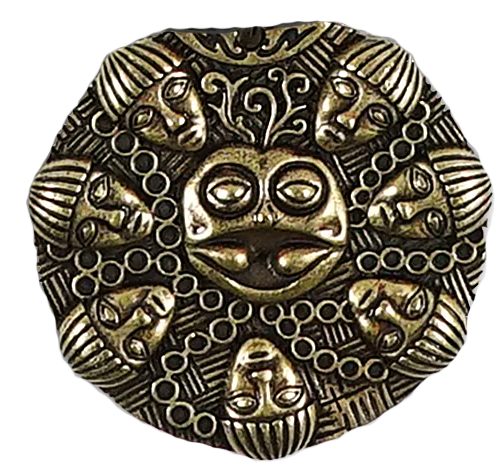

<!--
*** Thanks for checking out the projetc 'Diotilogie'. If you have a suggestion
*** that would make this better, please fork the repo and create a pull request
*** or simply open an issue with the tag "enhancement".
*** Don't forget to give the project a star!
*** Thanks again! Now go have fun exploring this resume! :D
-->

<!-- PROJECT SHIELDS -->
<!--
*** I'm using markdown "reference style" links for readability.
*** Reference links are enclosed in brackets [ ] instead of parentheses ( ).
*** See the bottom of this document for the declaration of the reference variables
*** for contributors-url, forks-url, etc.
-->

[![Contributors][contributors-shield]][contributors-url]
[![Forks][forks-shield]][forks-url]
[![Stargazers][stars-shield]][stars-url]
[![Issues][issues-shield]][issues-url]
[![MIT License][license-shield]][license-url]
[![LinkedIn][linkedin-shield]][linkedin-nicolas-url]
[![LinkedIn][linkedin-shield]][linkedin-maxime-url]

<!-- PROJECT LOGO -->
 

  

<h3 align="center">Ogma</h3>

  

    Retrouvez les citations de vos personnages favoris de la série Kaamelott, d'Alexandre Astier.
     
    <a href="https://github.com/Maxime-Boue/React-kaamelott-quotes"><strong>Explorer la documentation »</strong></a>
     
     
    <a href="https://github.com/Maxime-Boue/React-kaamelott-quotes">Voir une démo</a>
    ·
    <a href="https://github.com/Maxime-Boue/React-kaamelott-quotes/issues">Signaler un bug</a>
    ·
    <a href="https://github.com/Maxime-Boue/React-kaamelott-quotes/pulls">Demande de fonctionnalité</a>
  

<!-- TABLE OF CONTENTS -->

  
Sommaire

  <ol>
    <li>
      <a href="#about-the-project">A propos</a>
      <ul>
        <li><a href="#built-with">Développé avec</a></li>
      </ul>
    </li>
    <li>
      <a href="#getting-started">Commencer</a>
      <ul>
        <li><a href="#prerequisites">Pré-requis</a></li>
        <li><a href="#installation">Installation</a></li>
      </ul>
    </li>
    <li><a href="#usage">Usage</a></li>
    <li><a href="#roadmap">Feuille de route</a></li>
    <li><a href="#contributing">Contribuer</a></li>
    <li><a href="#license">License</a></li>
    <li><a href="#contact">Contact</a></li>
    <li><a href="#acknowledgments">Remerciements</a></li>
  </ol>

<!-- ABOUT THE PROJECT -->

## A propos

[![Product Name Screen Shot][product-screenshot]](https://www.ogma.nicolassaumont.com)

Bienvenue sur notre site dédié à l'univers hilarant de Kaamelott, la série culte d'Alexandre Astier ! Plongez dans l'univers médiéval déjanté du Roi Arthur et de ses chevaliers à la table ronde grâce à notre générateur de citations. Choisissez votre personnage préféré ou optez pour une citation aléatoire parmi l'ensemble des protagonistes. Que vous soyez fan de Perceval, Karadoc, Merlin, ou d'autres, vous trouverez ici des répliques mémorables pour égayer votre journée. Préparez-vous à rire et à revivre les moments épiques de cette série incontournable !

(<a href="#readme-top">Haut de la page</a>)

### Développé avec

- [![React][React]][React-url]

(<a href="#readme-top">Haut de la page</a>)

<!-- GETTING STARTED -->

## Commencer

Visitez https://www.ogma.nicolassaumont.com ou cliquez sur [ce lien](https://www.ogma.nicolassaumont.com). Si vous voulez accéder au projet en local, veuillez suivre les étapes suivantes :

### Installation

- Clonez ou téléchargez le projet depuis son dépôt Github.
- Placez-vous au répertoire du projet.
- Lancez `pnpm install` pour installer les modules node nécessaires.

### Execution

- Placez-vous à la racine du projet.
- Lancez l'application en utilisant la commande : `pnpm dev`
- Ouvrez un navigateur et aller sur `http://localhost:5173` pour accéder à l'application.

(<a href="#readme-top">Haut de la page</a>)

<!-- ROADMAP -->

## Feuille de route

### V1

- [x] Génération des cartes sur la page d'accueil
- [x] Sélection d'un personnage
- [x] Génération d'une citation
  - [x] Génération d'une citation aléatoire parmi tous les personnages
  - [x] Génération d'une citation aléatoire pour le personnage séléctionné
  - [x] Présentation de la citation générée
- [ ] Bouton de refresh des cartes présentées en page d'accueil
- [ ] Champ de recherche d'un personnage

### V2

- [ ] Quiz
  - [ ] Génération d'une citation aléatoire
  - [ ] Récupération de la réponse fournie par l'utilisateur
  - [ ] Comparaison de la réponse utilisateur avec la bonne réponse
  - [ ] Génération du résultat
- [ ] Page de présentation de chaque personnage
- [ ] Mise en place de choix de citations favorites
  - [ ] Création d'un espace utilisateur
  - [ ] CRUD des citations favorites

Voir les [problèmes non résolus](https://github.com/Maxime-Boue/React-kaamelott-quotes/issues) pour accéder à la liste complète des fonctionnalités proposées (et les bugs connus).

(<a href="#readme-top">Haut de la page</a>)

<!-- CONTRIBUTING -->

## Contributing

Les contributions sont ce qui fait de la communauté open source un endroit extraordinaire pour apprendre, inspirer et créer. Toutes vos contributions sont **très appréciées**.

Si vous avez une suggestion qui permettrait d'améliorer ce projet, merci de dupliquer le repo et de créer une requête. Vous pouvez aussi simplement ouvrir un problème avec le tag "enhancement".
N'oubliez pas de donner une étoile au projet ! Merci à tous !

(<a href="#readme-top">Haut de la page</a>)

<!-- LICENSE -->

## License

Distribué sous la licence MIT. Voir `LICENSE.txt` pour plus d'informations.

(<a href="#readme-top">Haut de la page</a>)

<!-- CONTACT -->

## Contact

Nicolas Saumont - [@NicolasSaumont](https://twitter.com/NicolasSaumont) - saumont.nicolas@gmail.com

Maxime Boué - [@MaximeBoue](https://twitter.com/MaximeBoue)

Project Link: [https://github.com/Maxime-Boue/React-kaamelott-quotes](https://github.com/Maxime-Boue/React-kaamelott-quotes)

(<a href="#readme-top">Haut de la page</a>)

<!-- ACKNOWLEDGMENTS -->

## Acknowledgments

- [Kaamelott's API](https://github.com/sin0light/api-kaamelott/)
- [Img Shield](https://shields.io/)
- [Best README Template](https://github.com/othneildrew/Best-README-Template/blob/master/README.md)

(<a href="#readme-top">Haut de la page</a>)

<!-- MARKDOWN LINKS & IMAGES -->
<!-- https://www.markdownguide.org/basic-syntax/#reference-style-links -->

[contributors-shield]: https://img.shields.io/github/contributors/Maxime-Boue/React-kaamelott-quotes.svg?style=for-the-badge
[contributors-url]: https://github.com/Maxime-Boue/React-kaamelott-quotes/graphs/contributors
[forks-shield]: https://img.shields.io/github/forks/Maxime-Boue/React-kaamelott-quotes.svg?style=for-the-badge
[forks-url]: https://github.com/Maxime-Boue/React-kaamelott-quotes/network/members
[stars-shield]: https://img.shields.io/github/stars/Maxime-Boue/React-kaamelott-quotes.svg?style=for-the-badge
[stars-url]: https://github.com/Maxime-Boue/React-kaamelott-quotes/stargazers
[issues-shield]: https://img.shields.io/github/issues/Maxime-Boue/React-kaamelott-quotes.svg?style=for-the-badge
[issues-url]: https://github.com/Maxime-Boue/React-kaamelott-quotes/issues
[license-shield]: https://img.shields.io/github/license/Maxime-Boue/React-kaamelott-quotes.svg?style=for-the-badge
[license-url]: https://github.com/Maxime-Boue/React-kaamelott-quotes/blob/main/LICENSE.txt
[linkedin-shield]: https://img.shields.io/badge/-LinkedIn-black.svg?style=for-the-badge&logo=linkedin&colorB=555
[linkedin-nicolas-url]: https://linkedin.com/in/nicolas-saumont
[linkedin-maxime-url]: https://www.linkedin.com/in/maxime-bou%C3%A9-dev/
[product-screenshot]: assets/img/screenshot.png
[React]: https://img.shields.io/badge/-ReactJs-61DAFB?logo=react&logoColor=white&style=for-the-badge
[React-url]: https://react.dev/
